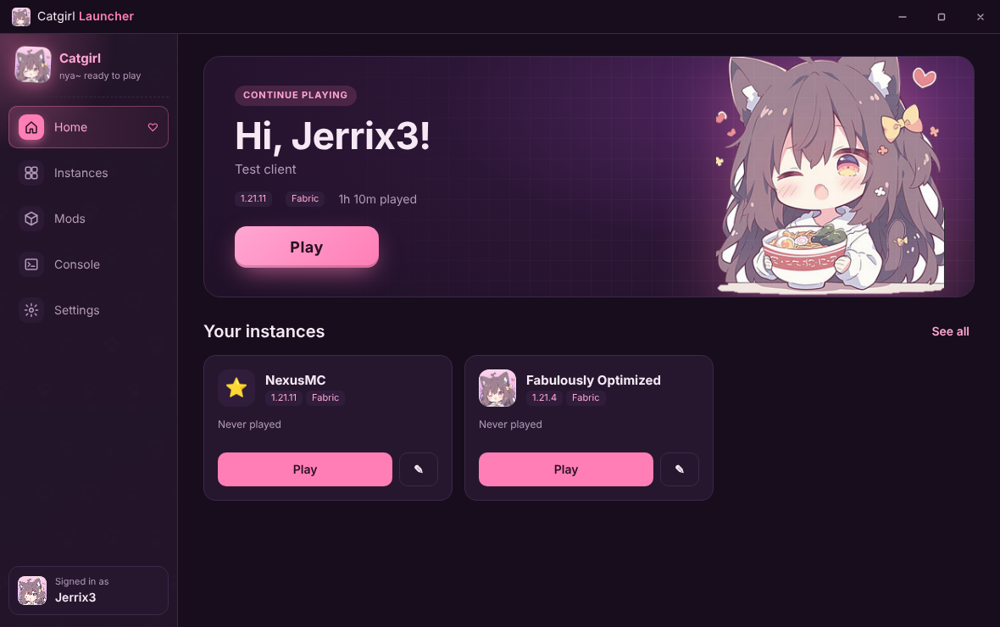
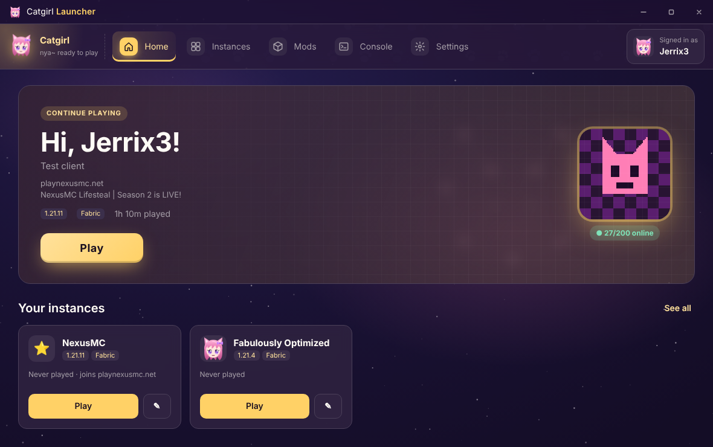
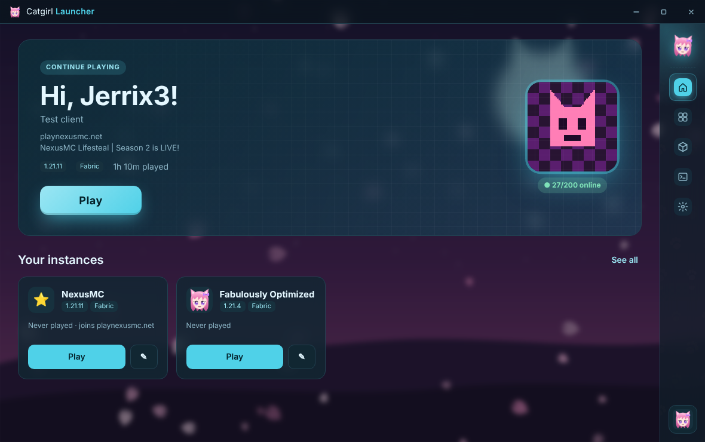
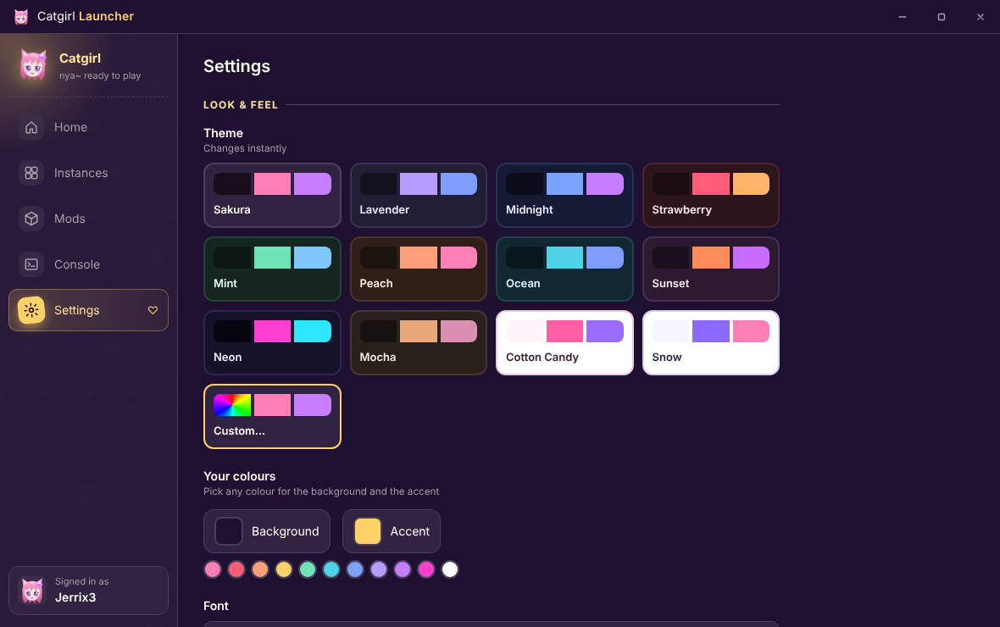

# Catgirl Client

**Catgirl Client is a Minecraft client that makes playing Minecraft cute, cosy and easy.**

Play any version, add mods in one click, and make the whole launcher your own. Nya~ 🐾

### [⬇️ Download for Windows](https://github.com/surv1/catgirl-launcher/releases/latest)

---

## ✨ Features

**🎮 Play any Minecraft version**
- Make as many **instances** as you like. Each one has its own version, mods, worlds and settings.
- **Vanilla** or **Fabric** for every version.
- **Join a server automatically** when you press Play.
- Sign in with your **Microsoft account**. Your login is stored safely on your own PC.
- **Java is downloaded for you.** No setup needed.

**🧩 Mods & modpacks**
- Browse and install **mods from Modrinth** in one click. Anything a mod needs is installed too.
- You only ever see mods made for **your instance's version**.
- Change an instance's Minecraft version and its **mods update to match** automatically.
- Install whole **Modrinth modpacks** in one click.
- Turn mods on or off, or remove them, from the launcher.

**🎀 Make it yours**
- **12 themes**, plus a **custom colour picker** for any colour you want.
- **Backgrounds:** cute built-in art, your own picture, or any image link, with dim and blur sliders.
- **Fonts:** pick from cute fonts or use any font on your PC.
- Put the menu on the **left, right, top or bottom**, with or without labels.

**🐱 Inside Minecraft**
- A **CatGirl title screen** with "CatGirl Launcher" in the corner and a quick menu (screenshots, mods folder, resource packs, change skin, settings).
- **Catgirl fun facts** in the yellow splash text. Over 90 of them!
- The game window is called **CatGirl Client**.
- **Discord status:** your friends see *Catgirl Launcher – Playing on (server)*, with a timer and a download button.

**💖 Comfy extras**
- Your **settings follow you to every instance**: controls, FOV, sensitivity, graphics, sound and your server list.
- The home screen shows **the last server you played on**, with its icon, message of the day and player count.
- **Closing the launcher never closes your game.**
- **Automatic updates.** You'll always have the newest version.

---

## 📥 How to install

**You need:** a Windows 10 or 11 PC and a Microsoft account that owns **Minecraft: Java Edition**.

1. Go to the **[latest release](https://github.com/surv1/catgirl-launcher/releases/latest)** and download **`Catgirl-Launcher-Setup-….exe`**.
2. Open the file you downloaded.
   - If Windows shows **"Windows protected your PC"**, click **More info → Run anyway**. This happens because the launcher is new and isn't code-signed yet.
3. Choose **Only for me**, click **Next**, then **Install**.
4. Open **Catgirl Launcher** from your Start menu or desktop.

## 🚀 Getting started

1. Click your profile in the bottom-left, then **+ Add Microsoft account**.
2. Click **Open login page**, type in the code the launcher shows you, and sign in.
3. Go to **Instances → + New instance**, pick a name and a Minecraft version (choose **Fabric** if you want mods), and click **Create**.
4. Press **Play!** The first launch takes a few minutes while Minecraft downloads. After that it's quick.
5. Visit **Settings** to pick your theme, background and font. 🎀

---

## ❓ Questions

**Do I need to install Java?**
No. The launcher downloads the right Java for each Minecraft version by itself.

**Do I need to update it myself?**
No. When a new version comes out, the launcher downloads it in the background and shows a **Restart to update** button.

**Why don't I see the CatGirl title screen?**
It works in **Fabric** instances. Edit your instance (✎), switch it to **Fabric**, and make sure **CatGirl title screen & menu** is on in **Settings**.

**Why isn't my Discord status showing?**
Make sure the **Discord desktop app** is open (not Discord in a browser), and that **Share my activity** is on in Discord's *Activity Privacy* settings.

**Can I use it on Mac or Linux?**
There's a Linux version (`.AppImage`) on the releases page. A Mac version isn't available yet.

**How do I uninstall it?**
Windows **Settings → Apps → Installed apps → Catgirl Launcher → Uninstall**.

---

Made with 💗 by **Jerrix**

*Catgirl Client is not affiliated with Mojang or Microsoft.*

